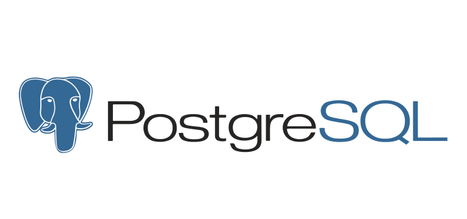

# PRIMCOP - The Prion Collaborative Maintenance Project

This interactive web app was created for the visual analysis of Q/N-rich amino acid sequences for different markers of prionic activity, namely intrinsic foldedness, prion aggregation propensity and prion maintenance propensity using the FoldIndex, PAPA, and PRIMA algorithms, respectively.

## Built With

- 
- 
- 

## License

This project is licensed under the MIT License - see the [LICENSE.md](LICENSE.md) file for details

## Acknowledgments

- **Kyle Maclea**
- **Raghava Adusimilli**
- **Stephen Dunn**
